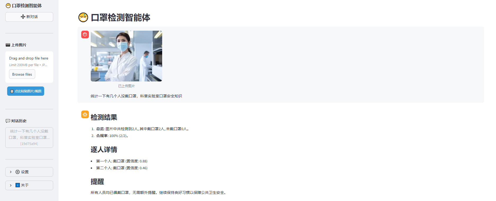
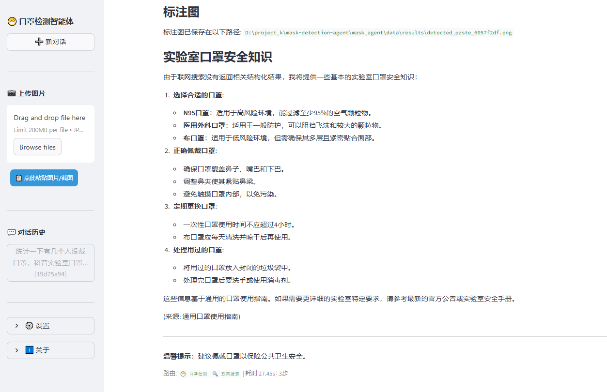
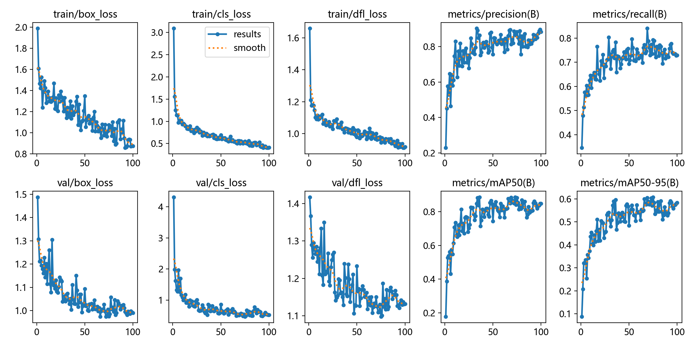
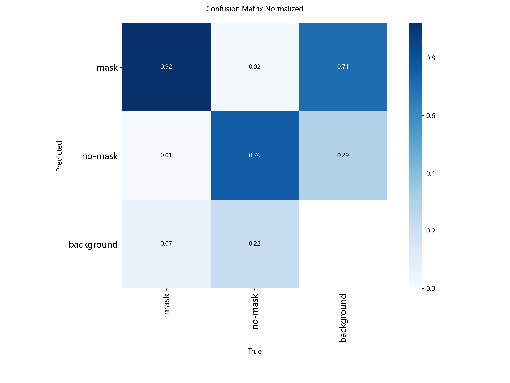
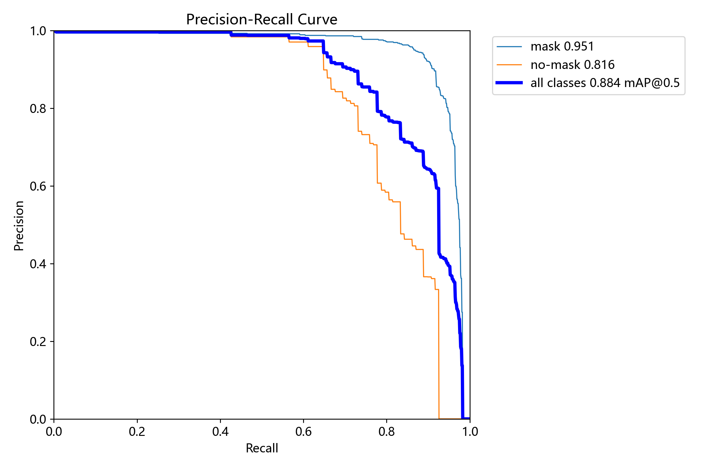
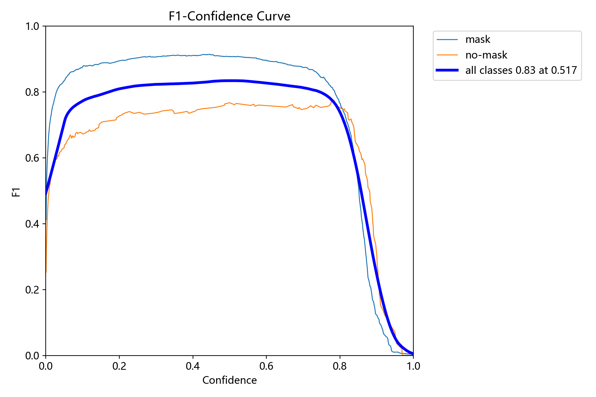
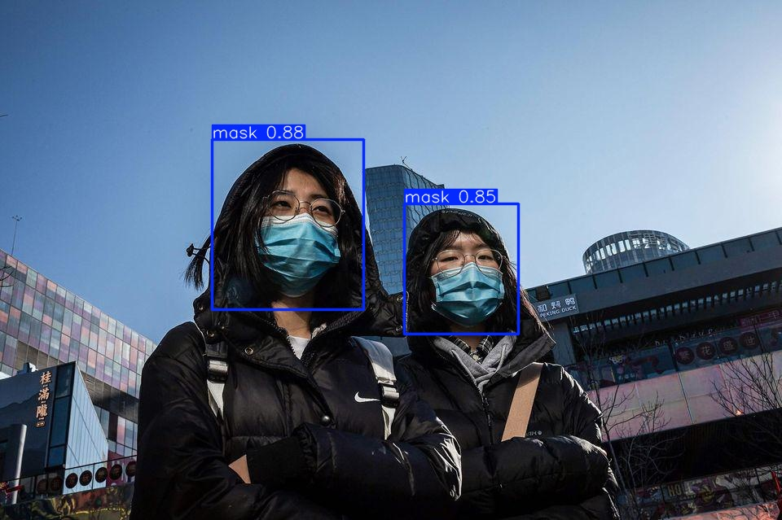
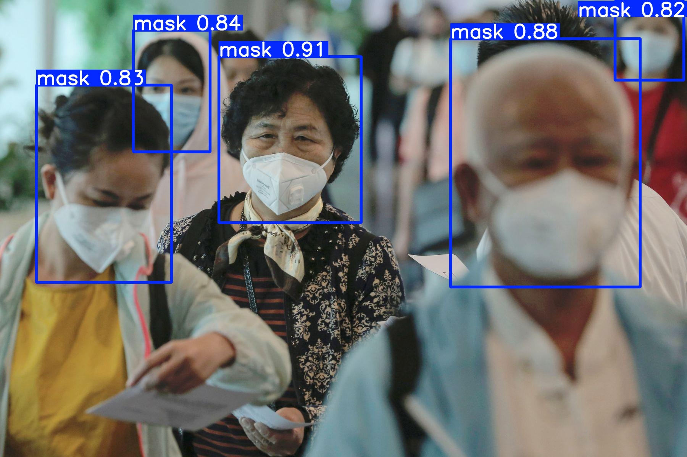
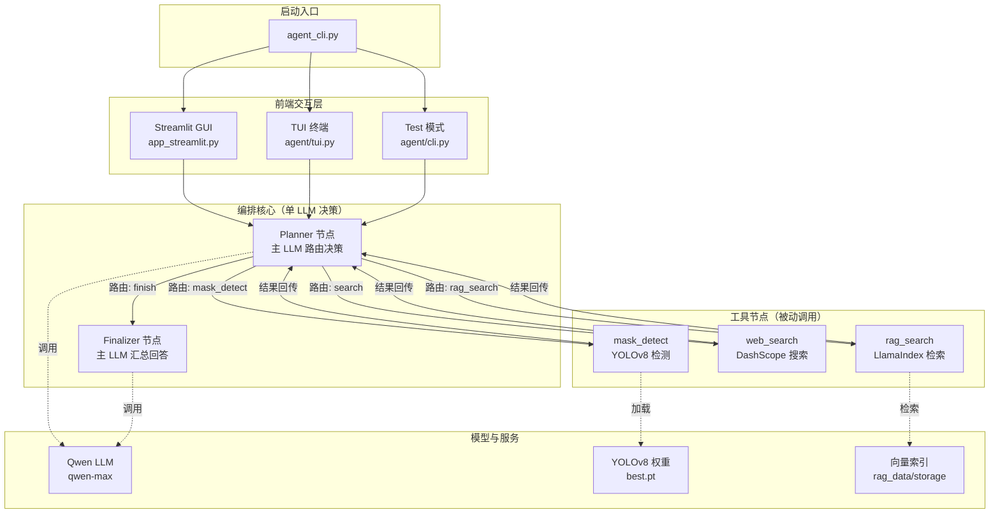
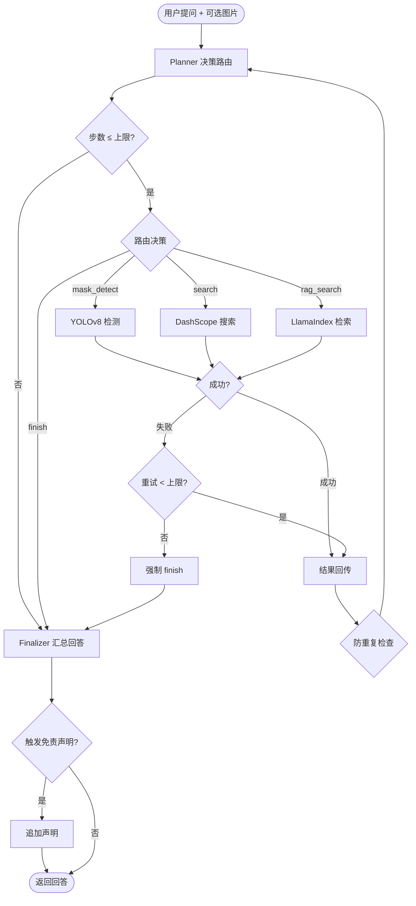

# 口罩检测智能体 (Mask Detection Agent)

[](https://www.python.org/)
[](https://pytorch.org/)
[](https://github.com/langchain-ai/langgraph)
[](https://python.langchain.com/)
[](https://docs.ultralytics.com/)
[](https://docs.llamaindex.ai/)
[](https://bailian.console.aliyun.com/)
[](https://streamlit.io/)
[](https://fastapi.tiangolo.com/)
[](LICENSE)

基于 **LangGraph 多智能体编排** 的多模态 AI 系统。用户可通过自然语言对话上传图片，系统自动调用 **YOLOv8** 完成口罩佩戴检测，并结合 **RAG 知识库**与**联网搜索**，精准回答口罩标准、选型、佩戴规范等专业问题。LLM 自主决策工具调用路径，实现"视觉检测 + 知识检索 + 实时信息"一站式闭环，显著提升检测可解释性与问答专业度。

---

## 效果展示

### 智能体交互示例

<table>
  <tr>
    <td width="50%" align="center"><b>示例 1：口罩检测 + 合规分析</b></td>
    <td width="50%" align="center"><b>示例 2：知识问答 + 检测</b></td>
  </tr>
  <tr>
    <td></td>
    <td></td>
  </tr>
</table>

### YOLOv8 训练结果

<table>
  <tr>
    <td width="50%" align="center"><b>训练曲线（loss / mAP）</b></td>
    <td width="50%" align="center"><b>归一化混淆矩阵</b></td>
  </tr>
  <tr>
    <td></td>
    <td></td>
  </tr>
  <tr>
    <td width="50%" align="center"><b>PR 曲线</b></td>
    <td width="50%" align="center"><b>F1 曲线</b></td>
  </tr>
  <tr>
    <td></td>
    <td></td>
  </tr>
</table>

**预测可视化示例**：

<table>
  <tr>
    <td width="50%" align="center"><b>预测示例 1</b></td>
    <td width="50%" align="center"><b>预测示例 2</b></td>
  </tr>
  <tr>
    <td></td>
    <td></td>
  </tr>
</table>

**训练指标**（实验 1：YOLOv8m, imgsz=640, 100 epochs, lr0=5e-4, lrf=0.01）：

| 指标 | 值 |
|------|-----|
| Precision | 0.8821 |
| Recall | 0.7926 |
| mAP@0.5 | 0.8839 |
| mAP@0.5:0.95 | **0.6106** |

> 实验 1 为 4 组对比实验中的综合最优（mAP@0.5:0.95 最高、Precision 最高、训练时间最短 1h41min）。完整对比详见 [experiments_comparison.html](experiments_comparison.html)。

---

## 架构

### 系统架构图



### 执行流程图



---

## 快速开始

> 完整训练与部署流程详见 [docs/training_deployment_guide.md](docs/training_deployment_guide.md)。

### 1. 安装

```bash
git clone https://github.com/<your-username>/mask-detection-agent.git
cd mask-detection-agent

conda create -n mask-agent python=3.10 -y
conda activate mask-agent

# PyTorch（按 CUDA 版本选择，参考 https://pytorch.org/）
pip install torch torchvision --index-url https://download.pytorch.org/whl/cu121

# 项目依赖（国内推荐清华源）
pip install -r mask_agent/requirements.txt -i https://pypi.tuna.tsinghua.edu.cn/simple
```

### 2. 配置

```bash
cp mask_agent/config/config.yaml.example mask_agent/config/config.yaml
```

编辑 `config.yaml`，填入 API Key：

| 配置项 | 说明 | 必填 |
|--------|------|------|
| `DASHSCOPE_API_KEY` | 阿里云百炼 API Key | 是 |
| `LLM_PROVIDER` | `dashscope`（云端）/ `ollama`（本地） | 是 |
| `MASK_MODEL_WEIGHTS` | YOLOv8 权重路径（留空自动搜索） | 否 |

### 3. 训练 YOLOv8（可选）

```bash
python yolov8_mask_v2/yolov8_mask_v2.py
```

训练完成后权重位于 `runs/mask_yolov8_v2/train*/weights/best.pt`。

### 4. 启动

```bash
cd mask_agent
python agent_cli.py --gui       # Streamlit Web GUI（推荐）
python agent_cli.py --tui       # 终端交互模式
python agent_cli.py --test "N95和医用外科口罩有什么区别?"  # 单条测试
```

浏览器自动打开 `http://localhost:8501`，支持图片上传 / 粘贴 / 截图。

---

## 项目结构

```
mask-detection-agent/
├── docs/
│   ├── training_deployment_guide.md  # 训练部署指南
│   └── images/                       # README 展示图片
├── mask_agent/                       # 智能体核心
│   ├── agent/                        #   LangGraph 编排（planner / 工具节点 / finalizer）
│   ├── config/                       #   配置（config.yaml.example 模板）
│   ├── prompts/                      #   提示词
│   ├── tools/                        #   工具（口罩检测 / 联网搜索 / RAG 检索 / PDF转MD）
│   ├── data/                         #   用户数据（不入库）
│   └── rag_data/                     #   RAG 知识库（PDF/索引不入库）
├── MaskDataSet/                      # 口罩检测数据集（mask / no-mask）
├── yolov8_mask_v2/                   # YOLOv8 训练脚本（v2，推荐）
├── agent_cli.py                      # 统一启动入口
├── app_streamlit.py                  # Streamlit GUI
├── api_server.py                     # 独立 FastAPI 检测服务
├── experiments_report.md             # 实验报告
└── LICENSE
```

---

## 注意事项

1. **API Key 安全**：`config.yaml` 已 gitignore，首次配置从 `.example` 复制
2. **YOLOv8 权重**：`*.pt` 不入库，请自行训练或下载
3. **RAG 知识库**：将 PDF 放入 `mask_agent/rag_data/`，首次启动自动构建索引
4. **第三方库**：`libs/` 和 `vendor/` 不入库，通过 `requirements.txt` 安装

---

## License

[MIT](LICENSE)
